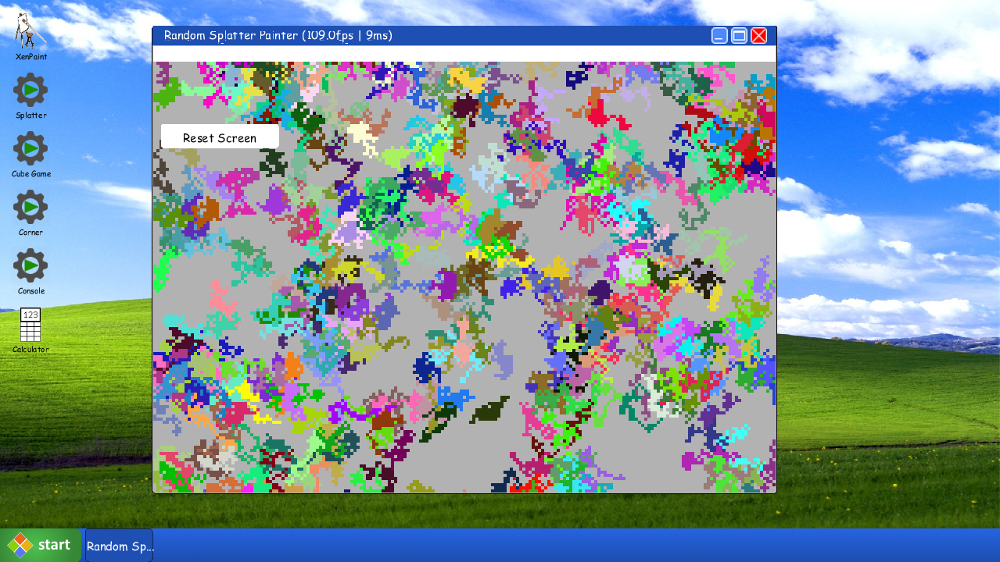
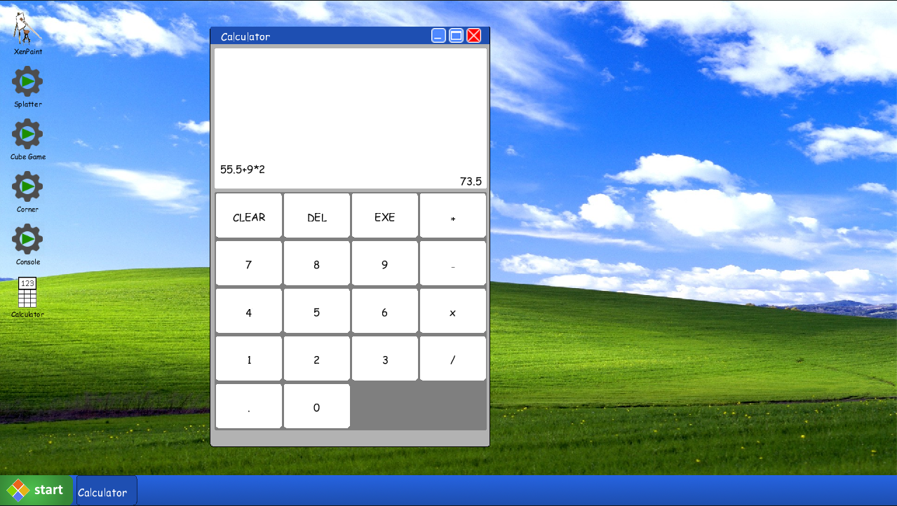
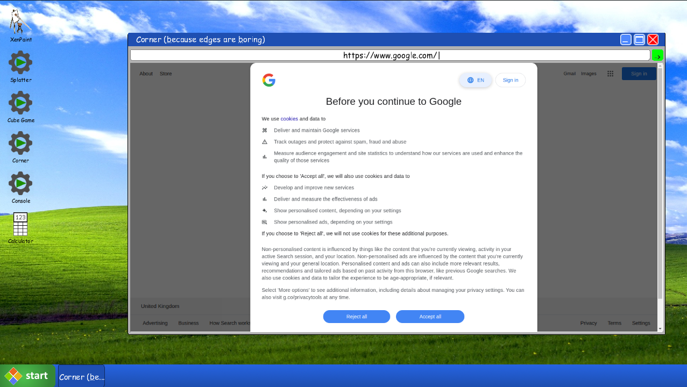
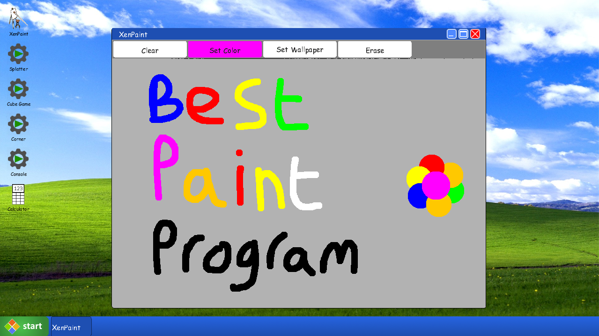

# Xendos
Created as part of my A-Level course in Computer Science, this is a simulated operating system that has a custom window manager and an extensible software system. Windows can be dragged, stacked, hidden, and unhidden. Additional software can be loaded directly from packaged jar files without needing to recompile Xendos. The Xendos development library has multiple UI elements to construct applications with.

## Software Examples

### Paint Splatter Demo

### Calculator

### Built-in Website Previewer

### XenPaint
